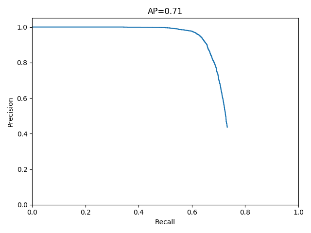

# Face detection
In this assignment we will implement a face detector.

If you're new to Python you might want to do a Python tutorial first. For NumPy and scikit-learn, have a look at https://numpy.org/doc/stable/user/index.html and https://scikit-learn.org/stable/user_guide.html, respectively.

# Results
1. When using a linear classifier, features should be (almost) linearly separable. SVMs use kernel functions to apply a nonlinear transformation without an increase in computational complexity. There is no need to calculate the feature transform explicitly, the kernel function can be directly computed in the original feature space. For a detailed explanation of the kernel trick, see lecture recordings.
2. SVMs maximize the margin between support vectors. In comparison to, e.g., LS learning for NNs, this results in less sensitivity to statistical variations or noise in our data. Generally, this results in a lower test error rate.

If you use the given parameters, evaluating on the complete test dataset leads to the following precision-recall-curve.

